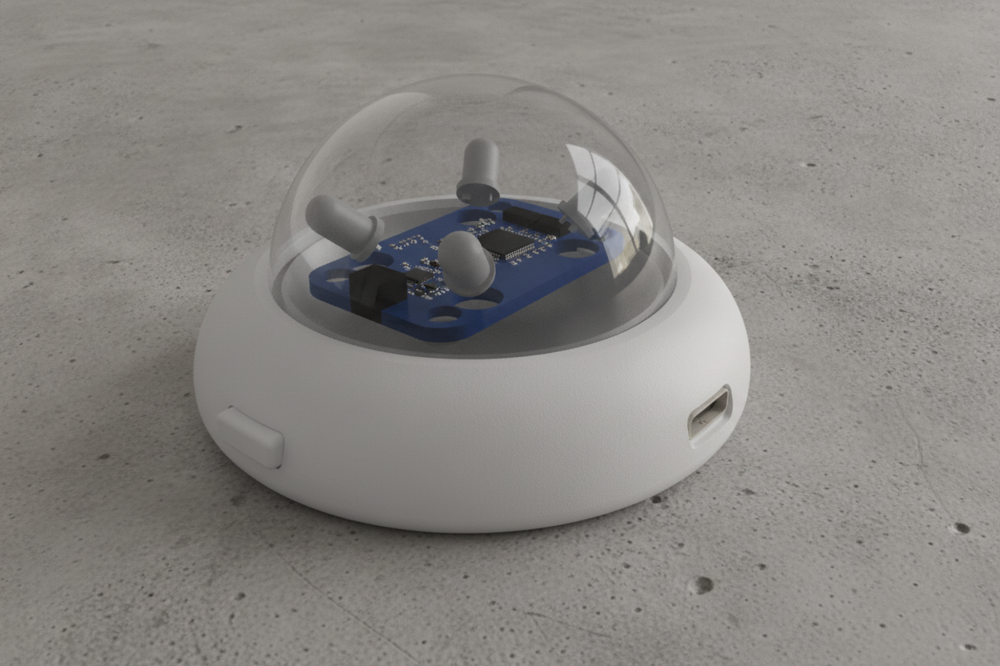

# NexusIR Device — Advanced IoT Controller (v1.6.0)

**NexusIR** is an enterprise-grade, agentic IoT smart hub powered by ESP32-C3/S3 and built natively on the **ESP-IDF** framework. It implements a highly scalable, P2P **ESP-NOW Master-Slave Architecture** and serves as an **Apple HomeKit Bridge** (with fallback to **ESP RainMaker**), bringing legacy infrared (IR) appliances, temperature sensors, relays, and up to 5 addressable RGB LED strips into Apple Home natively.

---

## 🗺 System Architecture

NexusIR splits hardware interfaces and protocol complexity via a robust Master-Slave pattern:

```mermaid
graph TD
    subgraph iOS Home App
        H[Apple Home App]
    end

    subgraph Master Node (ESP32-S3/C3)
        HK[HomeKit HAP Server]
        ME[Sync Engine]
        EN_M[ESP-NOW Master Driver]
        WEB[Local HTTP WebUI Server]
    end

    subgraph Slave Node AC (ESP32-C3)
        EN_S1[ESP-NOW Slave]
        IR_AC[IR TX Driver]
        AC[Air Conditioner]
    end

    subgraph Slave Node LEDs (ESP32-C3)
        EN_S2[ESP-NOW Slave]
        WS[WS2812B Driver]
        L1[Lamp 1]
        L2[Lamp 2]
    end

    H <== WiFi / HAP ==> HK
    HK <=> ME
    WEB <=> ME
    
    %% ESP-NOW P2P Bridging
    EN_M <=. ESP-NOW .=> EN_S1
    EN_M <=. ESP-NOW .=> EN_S2
    
    EN_S1 ==> IR_AC ==> AC
    EN_S2 ==> WS ==> L1 & L2
```

### Modes of Operation
Each peripheral (AC, Fan, Sensors, LED Lamps, Relays) can be configured independently in `menuconfig` as:
1.  **Master**: Publishes the accessory to HomeKit, manages network state, and bridges user control commands down to specific Slave MAC addresses via ESP-NOW.
2.  **Slave**: Bypasses local HomeKit instantiation, receives commands via ESP-NOW, and directly drives physical hardware pins (IR transmitters, WS2812B lines, Relays).
3.  **Standalone**: Combines logic and physical drivers on a single chip without using ESP-NOW.
4.  **Disabled**: Removes the feature completely from the firmware build to optimize heap RAM and free up GPIO pins.

---

## 🛠 Hardware Interface & GPIO Matrix

The following table reflects the default hardware mapping for **Standalone / Slave** nodes. All pins are configurable in `menuconfig`.

| Peripheral | GPIO (ESP32-C3) | Connection Type | Description / Notes |
| :--- | :--- | :--- | :--- |
| **IR Transmitter** | GPIO 4 | Output (RMT) | Requires 38kHz modulation transistor circuit |
| **IR Receiver** | GPIO 7 | Input (RMT) | VS1838B or similar 38kHz infrared receiver demodulator |
| **LED Lamp 1** | GPIO 2 | Output (RMT / PWM) | WS2812B Addressable LED strip or Single-color PWM |
| **LED Lamp 2** | GPIO 8 | Output (RMT / PWM) | Independent addressable RGB strip or PWM LED |
| **LED Lamp 3** | GPIO 9 | Output (RMT / PWM) | Independent addressable RGB strip or PWM LED |
| **LED Lamp 4** | GPIO 10 | Output (RMT / PWM) | Independent addressable RGB strip or PWM LED |
| **LED Lamp 5** | GPIO 18 | Output (RMT / PWM) | Independent addressable RGB strip or PWM LED |
| **I2C SCL** | GPIO 5 | Output (Open Drain) | AHT20 SCL clock line (requires pull-up resistors) |
| **I2C SDA** | GPIO 6 | I/O (Open Drain) | AHT20 SDA data line (requires pull-up resistors) |
| **Relay 1** | GPIO 12 | Output | Relays or SSR active control pin |
| **Relay 2** | GPIO 13 | Output | Relays or SSR active control pin |
| **Touch Button 1** | GPIO 14 | Input | Touch/Physical switch input (controls Relay 1) |
| **Touch Button 2** | GPIO 15 | Input | Touch/Physical switch input (controls Relay 2) |
| **System Button** | GPIO 3 | Input | Long press triggers IR Learning / Network reset |

> [!WARNING]
> Addressable WS2812B LEDs require a stable 5V power supply. The ESP32 logic pins operate at 3.3V. While WS2812B strips often trigger on 3.3V, a logic level shifter (e.g., AHCT125) is recommended for long data lines to prevent signal flickering.

---

## 📐 3D Enclosure & Industrial Design

The NexusIR device features a premium, sleek dome form factor. Its transparent upper shell allows infrared signals from the star-configured internal LEDs to propagate in a full 360-degree horizontal coverage matrix.

### Product Render Gallery
Here are the official 3D design renders of the NexusIR device:

| Exploded Case Components | Internal PCB & IR LEDs |
| :---: | :---: |
|  |  |

| Fully Assembled Device | High-Quality Desk Setup Render |
| :---: | :---: |
|  |  |

### 3D Printing Files
The CAD files are provided in the high-fidelity **3D Manufacturing Format (`.3mf`)**, containing all mesh data, orientation, and color information:

*   [Body.3mf](file:///Users/dangminhtam/Project-storage/My-Project/NexusIR/hardware/3d_print/Body.3mf) — The main outer casing ring hosting the PCB, status LEDs, and connectors.
*   [Top.3mf](file:///Users/dangminhtam/Project-storage/My-Project/NexusIR/hardware/3d_print/Top.3mf) — The upper transparent dome (best printed in transparent PETG or polycarbonate with aligned infill/100% infill for optical clarity).
*   [Holder.3mf](file:///Users/dangminhtam/Project-storage/My-Project/NexusIR/hardware/3d_print/Holder.3mf) — Internal bracket to securely position and mount the ESP32 board and sensors.
*   [Button.3mf](file:///Users/dangminhtam/Project-storage/My-Project/NexusIR/hardware/3d_print/Button.3mf) — The physical system button cap for IR learning and network reset.

All assets are located in the [hardware/3d_print/](file:///Users/dangminhtam/Project-storage/My-Project/NexusIR/hardware/3d_print/) directory.

### Color Customization Options
You can print the enclosure body in various colors to match your styling:

| Cosmic Black | Classic White | Sunset Orange | Sakura Pink |
| :---: | :---: | :---: | :---: |
|  |  |  |  |

---

## 📲 Provisioning & Setup Guide

### iOS Ecosystem (HomeKit native)
1.  **Boot**: Power on the Master node. The system status LED will enter a **Cyan breathing pattern**, indicating it is ready for Wi-Fi provisioning.
2.  **SoftAP Connection**: Connect your iPhone to the Wi-Fi network `NexusIR-Setup-XXXX` (where `XXXX` represents the last 4 characters of the device's MAC address).
3.  **Captive Portal**: A captive portal will automatically prompt you to scan for local networks. Select your home Wi-Fi SSID and enter the password.
4.  **Pairing**: Once the device connects to your router (status LED turns **Green**), open the iOS **Home App**.
5.  **Scan/Add**: Tap **Add Accessory** -> **More options...** and select **NexusIR Bridge**.
    *   **HomeKit Setup Code**: `111-22-333`
    *   **Setup ID**: `LP4C`
6.  **Bridge Sync**: All enabled sub-devices (AC, Fan, Temp/Humidity sensors, and Lights 1-5) will instantly populate in Apple Home as distinct accessories.

### Android Ecosystem (ESP RainMaker)
If `LAMP_MOBILE_PLATFORM` is set to Android in `menuconfig`:
1.  Launch the **ESP RainMaker** mobile app.
2.  Scan the QR code printed in the terminal logs on boot.
3.  Follow the app prompt to provision the Wi-Fi credentials over SoftAP or BLE.

---

## 🌐 Local Web UI & Gzip Asset Optimization

The device features an embedded Web UI Dashboard to configure advanced IR settings, color matrices, and OTA updates.

### Enabling the Web UI
*   **iOS (Default)**: Automatically broadcasted over mDNS. Connect to the same router and open `http://nexusir-xxxx.local` (where `xxxx` is the last 4 digits of the MAC address in lowercase).
*   **Android / RainMaker**: The Web UI is disabled by default to optimize MCU resources. To activate it, open the ESP RainMaker App and toggle the **"WebUI Config Mode"** switch.

### Recompiling & Compressing Web Assets
To prevent the Web UI assets (HTML, CSS, JS) from consuming precious SPIFFS storage, they are stored and served compressed in Gzip format (`.gz`).

If you modify the frontend files:
1.  Edit the source files located under `components/svc_web_server/web_src/`.
2.  Compile and compress the files by running the compression utility:
    ```bash
    chmod +x components/svc_web_server/compress_web.sh
    ./components/svc_web_server/compress_web.sh
    ```
3.  The script will clean the output directory and generate `index.html.gz`, `style.css.gz`, and `app.js.gz` inside `components/svc_web_server/www/`.
4.  Run `idf.py build` to package the new SPIFFS partition image.

---

## ⚙️ Advanced Menuconfig Configurations

Execute `idf.py menuconfig` to configure firmware behavior:

### 1. Device Configuration
*   **AC (Air Conditioner)**: Set to Master, Slave, Standalone, or Disabled. Under Master, enter the **AC Slave MAC Address** (e.g. `24:0A:C4:XX:XX:XX`).
*   **Fan**: Configure ESP-NOW status and Slave MAC.
*   **Temperature & Humidity**: Enable AHT20 hardware, define SCL/SDA pins, and configure Master/Slave routing.
*   **LED Lamp 1 to 5**:
    *   Configure custom display name (e.g. "Living Room Chandelier").
    *   Set type: **RGB LED Strip (WS2812B)** or **Single LED (PWM/GPIO)**.
    *   Define LED Count and GPIO pin.
*   **Dual Touch Relay**: Define names, active Relay outputs, and corresponding input Touch GPIOs.

### 2. ESP-NOW Configuration
*   **Device Name**: Internal broadcast ID.
*   **Sync Peers**: List up to 5 unique Slave MAC addresses to initialize secure ESP-NOW handshakes.

### 3. WiFi Configuration
*   **Transport Method**: Toggle SoftAP or BLE for provisioning.
*   **Proof of Possession (PoP)**: Password required for provisioning (Default: `12345678`).
*   **Fallback recovery**: If the router goes offline, the device starts `NexusIR-Recovery` hotspot (Password: `12345678`) to allow configuration updates.

### 4. OTA Configuration
*   **Automatic updates**: Periodically check for new binaries.
*   **OTA Server URL**: Remote URL hosting `nexus-ir.bin` and `version.txt` (Default: `http://Mac-mini-cua-ang.local:5555`).

---

## 📦 Compilation, Flashing & Monitoring

Ensure your ESP-IDF environment is active (e.g., version 5.x).

```bash
# 1. Source the environment (adjust path to your ESP-IDF installation)
. ~/esp/esp-idf/export.sh

# 2. Set target microcontroller
idf.py set-target esp32c3 # or esp32s3, esp32

# 3. Open configuration UI and customize settings
idf.py menuconfig

# 4. Build application and SPIFFS storage image
idf.py build

# 5. Flash and start monitoring serial logs
idf.py -p /dev/tty.usbserial-XXXX flash monitor
```

### Key Keyboard Shortcuts in Monitor:
*   `Ctrl + ]` : Exit monitor.
*   `Ctrl + T` then `Ctrl + R` : Reset MCU board.

---

## 💾 Pre-Compiled Sample Firmwares

To make deployment as quick as possible, this repository includes pre-compiled production binaries for major targets. These can be flashed directly onto your devices without requiring a full ESP-IDF build environment.

The pre-compiled packages are organized in the [firmware/](file:///Users/dangminhtam/Project-storage/My-Project/NexusIR/firmware/) directory:

```
firmware/
├── esp32/
│   ├── android/      # ESP RainMaker (Android) firmware
│   └── ios/          # Apple HomeKit (iOS) firmware
└── esp32c3/
    ├── android/      # ESP RainMaker (Android) firmware
    └── ios/          # Apple HomeKit (iOS) firmware
```

Each folder contains the complete binary set:
*   `bootloader.bin` — The secondary bootloader.
*   `partition-table.bin` — Cấu trúc phân vùng cho ứng dụng kép (OTA-ready) và SPIFFS.
*   `ota_data_initial.bin` — Dữ liệu khởi tạo cho bộ nạp OTA.
*   `nexus-ir.bin` — Ứng dụng chính.
*   `storage.bin` — Ảnh phân vùng SPIFFS chứa các asset Web UI đã được nén tối ưu.

### How to Flash Pre-Compiled Binaries
You can flash these binaries using Esptool. Connect your device via USB and run the command matching your target chip:

#### For ESP32-C3:
```bash
python -m esptool --chip esp32c3 -b 460800 --before default_reset --after hard_reset write_flash --flash_mode dio --flash_size 4MB --flash_freq 80m 0x0 firmware/esp32c3/ios/bootloader.bin 0x8000 firmware/esp32c3/ios/partition-table.bin 0x15000 firmware/esp32c3/ios/ota_data_initial.bin 0x20000 firmware/esp32c3/ios/nexus-ir.bin 0x3e0000 firmware/esp32c3/ios/storage.bin
```
*(Replace `ios` with `android` depending on your mobile platform selection).*

#### For ESP32:
```bash
python -m esptool --chip esp32 -b 460800 --before default_reset --after hard_reset write_flash --flash_mode dio --flash_size 4MB --flash_freq 40m 0x1000 firmware/esp32/ios/bootloader.bin 0x8000 firmware/esp32/ios/partition-table.bin 0x15000 firmware/esp32/ios/ota_data_initial.bin 0x20000 firmware/esp32/ios/nexus-ir.bin 0x3e0000 firmware/esp32/ios/storage.bin
```
*(Replace `ios` with `android` depending on your mobile platform selection).*

---

## 🔄 Reboot-to-Sync Engine (IR Learning)

To guarantee Apple HomeKit stability:
1.  **IR Capture**: Place the device in learning mode via the Web Dashboard and aim a remote controller at the receiver.
2.  **Save Key**: Assign the button name (e.g., `TiviPower`, `CustomMute`) and save it to NVS.
3.  **Sync Trigger**: HomeKit requires registration of accessories before the HAP server begins broadcasting. The device will request a restart.
4.  **Reboot Sync**: On boot, the integration layer reads all learned keys in NVS and registers corresponding bridged switch accessories, ensuring flawless synchronization in the Apple Home App.

---

## 📄 License
This project is licensed under the MIT License. See [LICENSE](LICENSE) for details.
