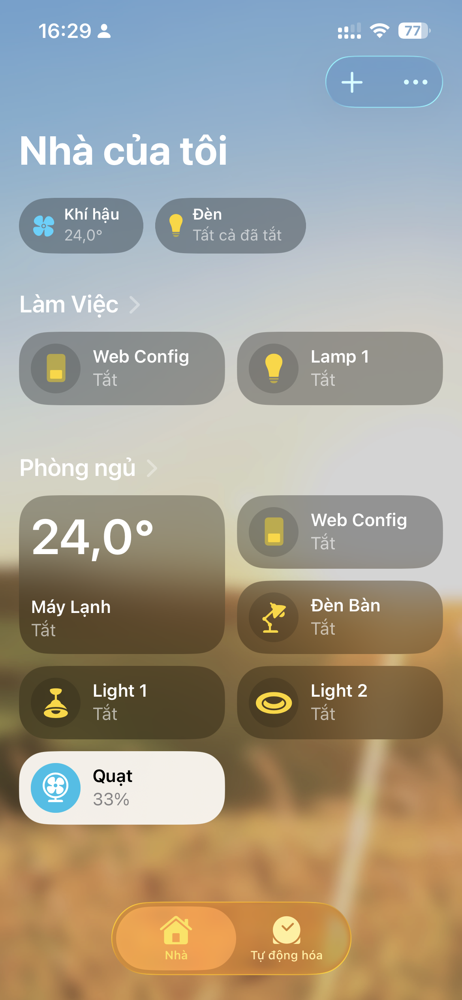
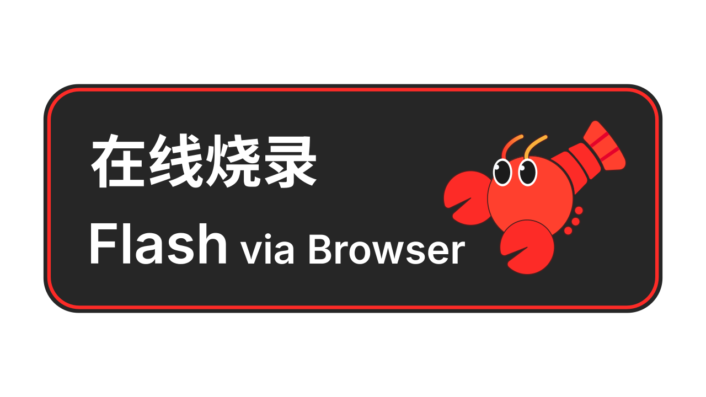

<div align="center">

  <a href="https://github.com/dangminhtam/NexusIR">
    
  </a>

  <h1>NexusIR 🛸 Universal Smart IoT & IR Hub for ESP32</h1>

  <h3>📡 Precision IR Core V3 · 🏠 Apple HomeKit & ESP RainMaker · ⚡ Event-Driven Engine · 🌐 Mesh ESP-NOW</h3>

  <p>
    <a href="https://www.espressif.com">
      
    </a>
    <a href="https://github.com/espressif/esp-idf">
      
    </a>
    <a href="./LICENSE">
      
    </a>
    
    
  </p>

  <a href="#-key-features">Key Features</a>
  |
  <a href="#-flash-via-browser-esp-web-tools">Flash via Browser</a>
  |
  <a href="#-quick-start">Quick Start</a>
  |
  <a href="#-architecture--storage-budget">Architecture & Storage</a>
  |
  <a href="#-rest-api--web-dashboard">Web & API</a>
  |
  <a href="#-host-unit-testing">Testing</a>
  |
  <a href="./README_VI.md">🇻🇳 Tiếng Việt</a>

</div>

---

**NexusIR** is an enterprise-grade, event-driven smart IoT hub engineered on **ESP-IDF v5.5** for the ESP32 series (ESP32 / ESP32-C3 / ESP32-S3). It seamlessly bridges consumer infrared appliances (Air Conditioners, Fans, TVs), multi-zone addressable RGB lighting, high-power relays, and environmental sensors into native **Apple HomeKit** and **ESP RainMaker** (Amazon Alexa & Google Assistant) ecosystems — fully controllable with sub-millisecond local latency, distributed ESP-NOW mesh networking, and an embedded offline dashboard.

<div align="center">
  <video src="picture/video.mp4" width="85%" controls></video>
  <p><i>NexusIR in action: Real-time IR capture, HomeKit pairing, and multi-zone lighting synchronization</i></p>
</div>

---

## 🌟 Key Features

Traditional smart IR remotes suffer from fragile learning, lossy pulse decoding, and cloud dependency. NexusIR introduces the **IR Core V3 Architecture**: an event-driven, hardware-decoupled engine with 20-byte packed binary format, hardware CRC32 integrity verification, atomic NVS migrations, and dynamic carrier modulation.

<table align="center">
  <tr>
    <th><div align="center"> 📡 Precision IR Core V3 </div></th>
    <th><div align="center"> 🏠 Native Dual Ecosystem </div></th>
  </tr>
  <tr>
    <td>
      <div align="center">
        Hardware RMT with 1-microsecond timing precision
        <br />
        Learns raw signals without decoding loss (AC & Fan matrix)
        <br />
        Dynamic carrier modulation (36 kHz to 56 kHz)
      </div>
    </td>
    <td>
      <div align="center">
        Native Apple HomeKit accessory protocol (HAP)
        <br />
        ESP RainMaker for Android, Alexa, and Google Assistant
        <br />
        Zero third-party bridge or cloud subscription required
      </div>
    </td>
  </tr>
  <tr>
    <td width="50%">
      <video src="picture/video.mp4" width="100%" controls></video>
    </td>
    <td width="50%">
      
    </td>
  </tr>

  <tr>
    <td colspan="2"><!-- spacer row --></td>
  </tr>

  <tr>
    <th><div align="center"> ⚙️ Event-Driven FreeRTOS Architecture </div></th>
    <th><div align="center"> 🌐 Mesh & Distributed Sync </div></th>
  </tr>
  <tr>
    <td>
      <div align="center">
        Ultra-thin ISR (&lt; 1.5 µs) dispatches to dedicated Worker Task
        <br />
        Monotonic Session IDs eliminate stale/cross-talk captures
        <br />
        15-second hardware watchdog timer prevents task lockups
      </div>
    </td>
    <td>
      <div align="center">
        ESP-NOW low-latency Master / Slave mesh topology
        <br />
        Sub-10ms peer-to-peer transmission across room nodes
        <br />
        Configurable as Master, Slave, Standalone, or Disabled
      </div>
    </td>
  </tr>

  <tr>
    <td colspan="2"><!-- spacer row --></td>
  </tr>

  <tr>
    <th><div align="center"> 🧬 Wire Format V1 & Safe Migration </div></th>
    <th><div align="center"> 💡 Multi-Zone Lighting & Sensors </div></th>
  </tr>
  <tr>
    <td>
      <div align="center">
        Strict 20-byte packed binary header with IEEE 802.3 CRC32
        <br />
        On-Access & Background Batch migration for legacy NVS keys
        <br />
        Power-loss safe: atomic commit guarantees zero data loss
      </div>
    </td>
    <td>
      <div align="center">
        Drives up to 5× WS2812B addressable RGB LED strips
        <br />
        AHT20 temperature & humidity continuous telemetry
        <br />
        Dual relay outputs with capacitive touch button interrupts
      </div>
    </td>
  </tr>

  <tr>
    <td colspan="2"><!-- spacer row --></td>
  </tr>

  <tr>
    <th><div align="center"> 🧰 Ready Out of the Box </div></th>
    <th><div align="center"> 🧩 Complete HAL Decoupling </div></th>
  </tr>
  <tr>
    <td>
      <div align="center">
        Gzip-compressed embedded dashboard served locally
        <br />
        JSON import/export API for easy profile backup and cloning
        <br />
        360-degree IR transparent dome enclosure (.3mf ready)
      </div>
    </td>
    <td>
      <div align="center">
        Strict separation: Logic (Manager) vs Hardware (Driver)
        <br />
        Zero <code>ESP_ERROR_CHECK()</code> panics for 24/7 uptime
        <br />
        3-second safety timeout on RMT TX prevents hardware freeze
      </div>
    </td>
  </tr>
</table>

---

## ⚡ Flash via Browser (ESP Web Tools)

You can install or update NexusIR firmware directly in your browser without setting up any command line tools or installing drivers:

<div align="center">
  <a href="https://Hdchipeo.github.io/NexusIR/flash/">
    
  </a>
  <p>
    👉 <a href="https://Hdchipeo.github.io/NexusIR/flash/"><strong>Open NexusIR Web Flasher</strong></a>
  </p>
</div>

> [!IMPORTANT]
> **Supported Browsers:** Google Chrome, Microsoft Edge, Opera on Windows, macOS, and Linux (requires Web Serial API support). Plug your ESP32-C3 via USB-C cable and click the button above!

---

## 📦 Quick Start

<div align="center">
  
</div>

NexusIR supports all ESP32-family chips with native RMT peripherals (ESP32, ESP32-C3, ESP32-S3). Defaults below are optimized for **ESP32-C3**:

### Hardware Pinout Map

| Peripheral | Default GPIO | Driver Type | Description |
| :--- | :---: | :---: | :--- |
| **IR Transmitter** | `GPIO 4` | RMT Output | Drives IR LED via NPN/MOSFET amplifier |
| **IR Receiver** | `GPIO 7` | RMT Input | TSOP38238 demodulator (Internal Pull-Up) |
| **RGB LED Lamp 1–5** | `2, 8, 9, 10, 18` | RMT / SPI | WS2812B addressable LED data lines |
| **I2C Bus (AHT20)** | `SDA=6, SCL=5` | I2C Master | Temperature & humidity sensor (400 kHz) |
| **Relay 1 / 2** | `GPIO 12, 13` | GPIO Output | High-power relay coils |
| **Touch Buttons** | `GPIO 14, 15` | GPIO Input | Capacitive touch switch interrupts |
| **System Button** | `GPIO 3` | GPIO Input | Factory reset & configuration toggle |

> [!NOTE]
> All GPIO mappings can be customized dynamically in `idf.py menuconfig` &rarr; `Device Configuration` &rarr; `IR Hardware`.

---

### Flash Pre-Built Firmware (CLI)

If you prefer flashing via terminal, binaries are available in [`firmware/`](firmware/):

```bash
# Example: Flash NexusIR on ESP32-C3 (iOS HomeKit build)
python -m esptool --chip esp32c3 -b 460800 write_flash \
  0x00000 firmware/esp32c3/ios/bootloader.bin \
  0x08000 firmware/esp32c3/ios/partition-table.bin \
  0x15000 firmware/esp32c3/ios/ota_data_initial.bin \
  0x20000 firmware/esp32c3/ios/nexus-ir.bin \
  0x3e0000 firmware/esp32c3/ios/storage.bin
```

> [!TIP]
> Replace `ios` with `android` in the path above for **ESP RainMaker** (Android, Alexa, Google Home) builds.

---

### Build from Source

Ensure you have **ESP-IDF v5.5.x** installed:

```bash
# 1. Activate ESP-IDF environment
. ~/esp/esp-idf/export.sh

# 2. Set target chip
idf.py set-target esp32c3    # Or esp32 / esp32s3

# 3. Configure features (Ecosystem, GPIOs, ESP-NOW)
idf.py menuconfig

# 4. Build, flash, and monitor
idf.py build
idf.py -p /dev/tty.usbserial-XXXX flash monitor
```

---

### Pairing & Wi-Fi Provisioning

<table align="center">
  <tr>
    <th width="50%"><div align="center"> 🍎 Apple HomeKit (iOS) </div></th>
    <th width="50%"><div align="center"> 🤖 ESP RainMaker (Android / Alexa / Google) </div></th>
  </tr>
  <tr>
    <td>
      <ol>
        <li>Connect to Wi-Fi hotspot: <code>NexusIR-Setup-XXXX</code></li>
        <li>Captive portal automatically opens &rarr; Select your home Wi-Fi & enter credentials.</li>
        <li>Open Apple <b>Home App</b> &rarr; Tap <b>+</b> &rarr; <b>Add Accessory</b> &rarr; <b>More Options</b>.</li>
        <li>Select <b>NexusIR Bridge</b> &rarr; Enter Setup Code: <code>111-22-333</code>.</li>
      </ol>
    </td>
    <td>
      <ol>
        <li>Open the <b>ESP RainMaker</b> App (Google Play / App Store).</li>
        <li>Tap <b>Add Device</b> &rarr; Scan QR Code on device or discover via BLE / SoftAP.</li>
        <li>Enter Proof of Possession (PoP): <code>12345678</code>.</li>
        <li>Link RainMaker skill in the Alexa / Google Home App for voice control.</li>
      </ol>
    </td>
  </tr>
</table>

---

## 🏗️ Architecture & Storage Budget

### Distributed Node Topologies

NexusIR supports flexible operating modes configured on a per-peripheral basis:

```
┌─────────────────────────────────────────────────────────┐
│        iOS Home App / RainMaker App / Web Dashboard     │
└────────────────────────┬────────────────────────────────┘
                         │ Wi-Fi (HAP / MQTT)
               ┌─────────▼──────────┐
               │   Master Node      │
               │  HomeKit + Sync    │
               │  Engine + Web UI   │
               └──┬──────────────┬──┘
        ESP-NOW   │              │   ESP-NOW
           ┌──────▼────┐   ┌────▼───────┐
           │ Slave: AC │   │ Slave: LED │
           │ IR TX/RX  │   │ WS2812B ×5 │
           └────────────┘   └────────────┘
```

- **Master:** Hosts HomeKit / RainMaker service, sync engine, and routes commands over ESP-NOW.
- **Slave:** Dedicated hardware node responding to sub-10ms ESP-NOW packets (e.g. lamp on a nightstand, IR blaster on a ceiling).
- **Standalone:** Self-contained single-chip operation with all services running locally.

---

### Wire Format V1 Binary Specification

Every learned signal is encapsulated in a compact, portable binary structure `#pragma pack(push, 1)`:

```
+-----------------------------------------------------------------------+
| Magic (4B)  | Ver (1B) | Flags (1B) | Carrier (2B) | Duty (1B) | Rep (1B) |
| 0x5249584E  |   0x01   | Bitmask    |  38000 Hz    |    33%    |  0 or 1  |
+-----------------------------------------------------------------------+
| Gap (2B)    | DurCount (2B) |       CRC32 (4B, Little-Endian)         |
| 40 ms       | N halfwords   | esp_rom_crc32_le over raw pulse payload |
+-----------------------------------------------------------------------+
| Payload: uint16_t durations[DurCount]                                |
| [Mark 0, Space 0, Mark 1, Space 1, ... Mark N-1]                      |
+-----------------------------------------------------------------------+
```

### Quantitative Storage Budget (IR-12)

NexusIR allocates **32 KB** (8 Flash pages × 4096B) for the `nvs` partition (~27.5 KB effective user space):

| Appliance Type | Average Pulses | Payload Size | Total Record (V1) | NVS Slots | Est. Capacity in 32KB NVS |
| :--- | :---: | :---: | :---: | :---: | :---: |
| **TV / Fan (NEC / RC5)** | 32 - 68 pulses | 64 - 136 B | **84 - 156 bytes** | ~3 - 5 entries | **180 - 220 keys** |
| **Air Conditioner (Matrix)** | 100 - 240 pulses | 200 - 480 B | **220 - 500 bytes** | ~7 - 16 entries | **35 - 45 AC states** |

> [!TIP]
> A full AC profile (16 temperature states: Off, 16°C – 30°C) consumes **~5.6 KB**. Together with 20 TV/Fan keys (~2.5 KB), total memory usage is **~8.1 KB / 27.5 KB (~30%)**, leaving 70% headroom for system metadata.

---

## 🌐 REST API & Web Dashboard

NexusIR includes a lightweight, gzip-compressed local web dashboard accessible at `http://nexusir-xxxx.local`.

<div align="center">
  
</div>

### Core HTTP Endpoints

| Endpoint | Method | Status Codes | Description |
| :--- | :---: | :---: | :--- |
| `/api/learn/status` | `GET` | `200` | Returns live learning state (`ARMED`, `CAPTURED`, `TIMEOUT`), session ID, and pulse count |
| `/api/send?key={key}` | `POST` | `200, 404, 409, 500` | Transmits an IR key. Returns **409 Conflict** if learning is currently active |
| `/api/ir/export?key={key}` | `GET` | `200, 404` | Exports key metadata (carrier, repeats, CRC32) and raw duration array as JSON |
| `/api/ir/import?key={key}` | `POST` | `200, 400` | Validates, normalizes, serializes V1 record, and stores imported JSON in NVS |
| `/api/ir/storage` | `GET` | `200` | Returns NVS health: used entries, free entries, and estimated AC/TV slots remaining |
| `/api/ir/migrate` | `POST` | `200` | Manually triggers full partition audit and migration of legacy records |

---

## 🧪 Host Unit Testing

To accelerate development and prevent regressions without physical hardware, the IR Waveform Engine is completely decoupled from RTOS dependencies. You can compile and run the test suite on **macOS / Linux** in **&lt; 50 milliseconds**:

```bash
# Compile and execute host regression test suite
clang -O2 -Wall -Wextra -Icomponents/mgr_ir_protocols/include \
  test/test_ir_waveform_host.c -o test/test_ir_waveform_host && ./test/test_ir_waveform_host
```

```text
=====================================================
  Running NexusIR Waveform Engine Host Test Suite    
=====================================================
  [PASS] test_waveform_normalization
  [PASS] test_odd_duration_overread_prevention
  [PASS] test_v1_serialization_and_deserialization
  [PASS] test_crc32_corruption_detection
  [PASS] test_legacy_raw_upgrade
  [PASS] test_legacy_matrix_upgrade
=====================================================
  ALL 6 HOST UNIT TESTS PASSED SUCCESSFULLY!         
=====================================================
```

---

## 🖨️ 3D Enclosure

NexusIR features a custom dome enclosure engineered for optimal **360° omnidirectional IR radiation** with high infrared transmittance. Ready-to-print `.3mf` files are located in [`hardware/3d_print/`](hardware/3d_print/):

<table align="center">
  <tr>
    <th><div align="center"> Matte Black </div></th>
    <th><div align="center"> Pearl White </div></th>
    <th><div align="center"> Cyber Orange </div></th>
    <th><div align="center"> Pastel Pink </div></th>
  </tr>
  <tr>
    <td></td>
    <td></td>
    <td></td>
    <td></td>
  </tr>
</table>

---

## 📷 Follow Us

If NexusIR powers your smart home, please give the project a star! ⭐

<div align="center">
  <a href="https://www.star-history.com/?repos=dangminhtam%2FNexusIR&type=date&legend=top-left">
    <picture>
      <source media="(prefers-color-scheme: dark)" srcset="https://api.star-history.com/chart?repos=dangminhtam%2FNexusIR&type=date&theme=dark&legend=top-left" />
      <source media="(prefers-color-scheme: light)" srcset="https://api.star-history.com/chart?repos=dangminhtam%2FNexusIR&type=date&legend=top-left" />
      
    </picture>
  </a>
</div>

---

## Acknowledgements

- [Espressif Systems](https://github.com/espressif) for the outstanding ESP-IDF framework and RMT driver.
- [HomeKit ADK & ESP-HomeKit-SDK](https://github.com/espressif/esp-homekit-sdk) for Apple HomeKit Accessory Protocol support.
- [ESP RainMaker](https://rainmaker.espressif.com/) for cloud-agnostic Android and voice assistant integration.
- [IRremoteESP8266](https://github.com/crankyoldgit/IRremoteESP8266) for reference IR timing formats.
- Inspired by Espressif's open-source engineering standards ([esp-claw](https://github.com/espressif/esp-claw)).

---

## License

This project is open-sourced under the **MIT License**. See the [LICENSE](LICENSE) file for complete details.
